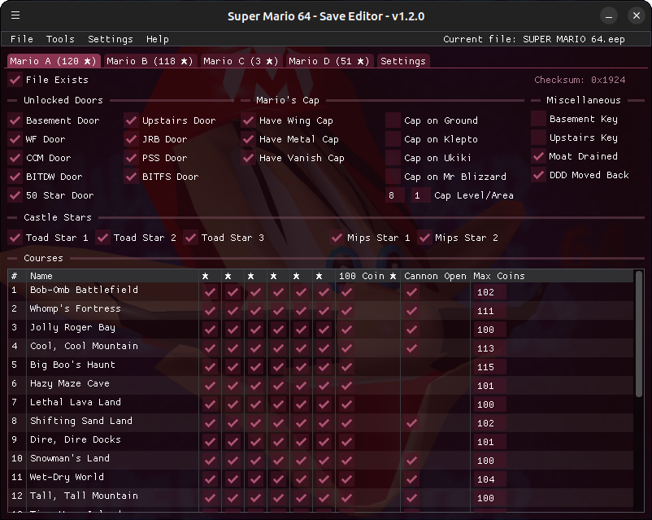

# Super Mario 64 - Save Editor

This is a save editor for Super Mario 64. It is compatible with saves of the Nintendo 64 version and the PC port.

## Requirements

The program runs on Windows and Linux and requires a GPU compatible with OpenGL 3.3.

## Features

- It can edit save files from the Nintendo 64 and PC versions of the game.
- If a save slot is corrupt the program might be able to recover it. Just open the save file and save it again.
- Can unlock a 100% completed save in any slot.

## Changelog

You can check the changelog [here](https://github.com/MaikelChan/SM64SaveEditor/blob/main/CHANGELOG.md).

## Screenshots

